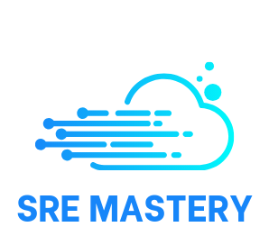

# Welcome to SRE Mastery

---

## Embark on Your Journey to Site Reliability Engineering Excellence

Welcome to **SRE Mastery**, your comprehensive guide to mastering the principles and practices of Site Reliability Engineering. Whether you're a seasoned engineer looking to deepen your expertise or just starting on your path to becoming an SRE, this is the place for you.

Our mission is to provide clear, concise, and practical knowledge to help you build and maintain scalable and highly reliable systems.

## What You'll Find Here

This project is a living document, constantly evolving with new content. Here's what you can explore right now:

### 🚀 Getting Started

If you are new to SRE, start here to understand the fundamental concepts. We cover:

- The core principles of SRE.
- How SRE differs from traditional operations.
- Key metrics like SLOs, SLIs, and Error Budgets.

### ☁️ Azure DevOps

Dive into the world of CI/CD and DevOps practices with Microsoft Azure. This section provides guides on:

- Setting up your first pipeline.
- Best practices for source control.
- Automating your infrastructure deployments.

### ☸️ Azure Kubernetes Service (AKS)

Learn how to deploy, manage, and scale containerized applications using Kubernetes on Azure. We cover everything from the basics to advanced topics:

- Creating and configuring your AKS cluster.
- Deploying applications with `kubectl`.
- Monitoring and scaling your services.

---

## About Me

About Me and What all I do 😀
